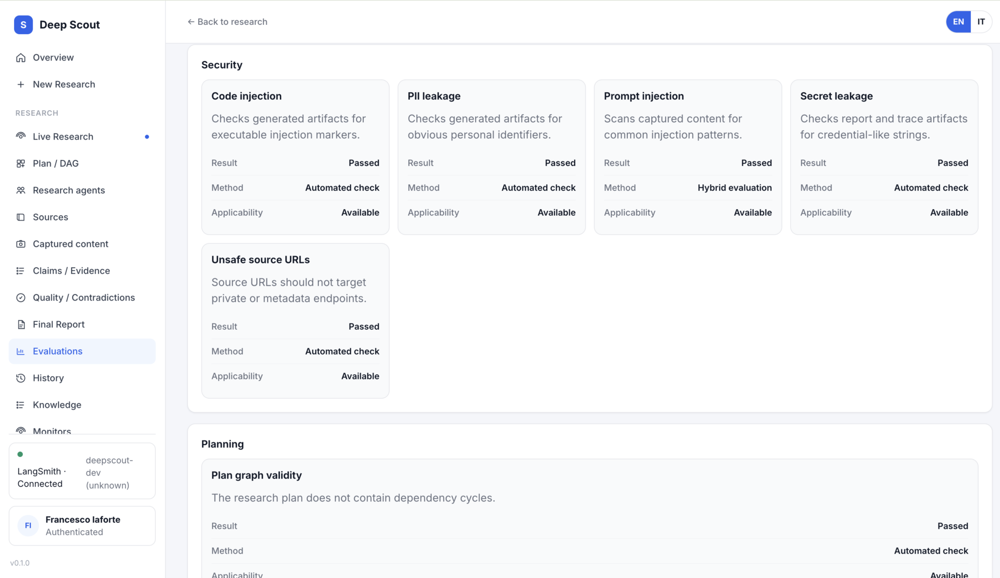

# DeepScout

[](https://github.com/francescoveryra-dot/deepscout/actions/workflows/ci.yml)
[](https://github.com/francescoveryra-dot/deepscout/actions/workflows/codeql.yml)
[](LICENSE)

**Version 0.1.1** · [Live app](https://deep-scout-plum.vercel.app) · [Explore demo](https://deep-scout-plum.vercel.app/demo)

DeepScout is an open-source system for structured, evidence-based research. It turns a research goal into an explicit workflow: requirements, a task plan, source collection, evidence extraction, coverage checks, a cited report, and persisted evaluations.

Its focus is narrower than that of a general-purpose AI assistant such as ChatGPT. DeepScout is not intended to replace one or to claim better answers in general; it is built to make a research process inspectable and its conclusions traceable to captured evidence.

<p align="center">
  
</p>

## Research as an inspectable process

A chat assistant can take a question and return an answer, with or without web search. DeepScout instead persists the intermediate research artifacts so that the path from the original request to the final report can be inspected:

```text
Question → ResearchContract → task DAG → source discovery and retrieval
         → claims ↔ evidence quotes ↔ source snapshots
         → requirement coverage → bounded corrective research
         → synthesis → cited report + final critic → evaluations
```

Language models assist planning, synthesis, and report writing. Application code remains responsible for budgets, phase order, task dependencies, tool authorization, persistence, evidence checks, HITL decisions, and terminal status.

Finding relevant pages is not treated as proof that the question has been answered. A coverage map relates material requirements to attributed claims and evidence. Its states include `supported`, `partial`, `conflicting`, `unsupported`, `searched_no_evidence`, and `not_researched`. If a central requirement remains unresolved and the selected mode, policy, and budget allow it, DeepScout adds focused gap-research tasks. The final critic checks unresolved requirements and report structure before a run can be marked complete.

The evidence path is more specific than a bibliography appended to generated text:

```text
Research requirement → Claim → Evidence quote → immutable SourceSnapshot → Source
```

The runtime is designed for research across different domains; the AI, regulation, EV, and RAG demos are examples rather than a fixed subject list. This is a design scope, not a claim that every topic works equally well.

DeepScout also does not guarantee that every question has a verifiable answer. Results depend on the availability, accessibility, quality, and freshness of sources, the chosen research budget, and provider/model limits. When the collected evidence is insufficient, the intended output is an explicit gap or uncertainty, not invented certainty.

DeepScout is maintained as a personal open-source project. Planning, retrieval, evidence persistence, hosted authentication, and the control loop are implemented; research quality still depends on the problem and available evidence.

## Try it

| Path | What you get |
|------|----------------|
| [**Live app**](https://deep-scout-plum.vercel.app) | Hosted instance (MODE B): GitHub sign-in, BYOK provider keys |
| [**Explore demo**](https://deep-scout-plum.vercel.app/demo) | Five completed research runs, read-only, no signup, no provider spend while browsing |
| [**Sign in**](https://deep-scout-plum.vercel.app/login) | GitHub OAuth (Google when configured on the instance) |
| **Clone & run locally** | MODE A: no login, keys in `.env` — see [Local development](docs/local-development.md) |
| **Run released containers** | Public GHCR images with API, worker, web, Postgres, and migrations — see [Docker](docs/docker.md) |
| **Deploy your own** | [Self-hosting guide](docs/DEPLOYMENT.md) |

The public deployment splits **Vercel** (Next.js frontend) and a **persistent API + worker** (Railway in the reference setup) plus **PostgreSQL + pgvector**. One-click Vercel-only deploy is not supported — the worker and database are required.

## Releases and containers

- [Latest GitHub Release](https://github.com/francescoveryra-dot/deepscout/releases/latest)
- [`deepscout-api` package](https://github.com/francescoveryra-dot/deepscout/pkgs/container/deepscout-api) — API, worker, and migration roles
- [`deepscout-web` package](https://github.com/francescoveryra-dot/deepscout/pkgs/container/deepscout-web) — Next.js runtime for the release compose stack

Tagged releases publish `linux/amd64` and `linux/arm64` images with exact version, minor,
immutable SHA, and `latest` tags. Runtime credentials remain external.

```bash
git clone --branch v0.1.1 --depth 1 https://github.com/francescoveryra-dot/deepscout.git
cd deepscout
cp .env.example .env
docker compose -f infra/docker/docker-compose.release.yml pull
docker compose -f infra/docker/docker-compose.release.yml up -d
```

This starts a local MODE A stack and applies Alembic migrations once before the API and worker.
Provider credentials are only required when executing research. See [Docker](docs/docker.md) for
verification, shutdown, and source-build commands.

## Implemented workflow

1. **Research goal** — Quick, Standard, or Deep mode; output language; optional model/region/freshness hints. The modes share the same evidence and material-coverage rules: Quick uses smaller bounds, Standard is the balanced default, and Deep allows more tasks, sources, corrective rounds, and report rewrites.
2. **Planning** — Semantic planner produces a task DAG with dependencies.
3. **Orchestration** — Python state machine runs phases under a hard `ResearchBudget`.
4. **Research workers** — bounded LangGraph search workers under the application-owned orchestrator; structured LLM calls assist planner, synthesis, and report phases.
5. **Source discovery & fetch** — capability-aware router over indexed web, OpenAlex, and GitHub public
   discovery; portfolio/diversity stopping; SSRF-safe acquisition for HTML, text, JSON, XML,
   RSS/Atom, PDF, and accessible public video metadata/captions.
6. **Retrieval** — Run-scoped hybrid RAG: dense pgvector + Postgres FTS, fused with RRF, deterministic rerank.
7. **Claims & evidence** — Claims linked to snapshot quotes; provenance chain to sources.
8. **Quality** — Evidence-backed material requirement coverage, bounded corrective research, contradiction detection, and a contract-aware final critic.
9. **Report** — Markdown report with citations rendered in the UI (not raw `**` / pipe tables).
10. **Evaluations** — The registry exposes 53 evaluator slots per run; deterministic results are persisted alongside explicit unavailable/skipped states.
11. **Continuous learning** — Non-demo terminal runs can create sanitized learning cases. Candidate policy changes pass through diagnosis, bounded experiments, risk-based promotion, optional HITL, versioning, monitoring, and rollback. Web content and user feedback are not operational authority. DeepScout does not autonomously modify its source code or train models. See [Continuous learning architecture](docs/architecture/CONTINUOUS_LEARNING.md).
12. **Hosted extras** — BYOK vault, tenant isolation, public demo catalog, `/learning` operator UI, optional LangSmith tracing.

Not included as production backends today: SPLADE, Neo4j GraphRAG, community GraphRAG, paid LLM rerankers (cross-encoder optional), or online RAGAS. Production hybrid retrieval uses **BM25 + Postgres FTS + dense pgvector** fused with RRF. See [AI & retrieval architecture](docs/architecture-overview.md) and [ADR-013](docs/architecture/adr/ADR-013-retrieval-upgrade.md).

## Screenshots

<p align="center">
  
  &nbsp;
  
</p>

| Area | |
|------|---|
| Planning & agents |  |
| Sources | Fetched URLs, pin/exclude, export CSV/JSON —  |
| Captured content | Source snapshots, word counts, linked evidence, download —  |
| Claims / evidence | Verified claims with quotes and source links —  |
| Quality | Deterministic checks + contradiction cards —  |
| Final report | Rendered Markdown, PDF/JSON export, follow-up —  |
| Evaluations | Explicit result, method, and applicability per evaluator —  |
| Public demo | Read-only completed runs —  |

## Stack (summary)

| Layer | Technology |
|-------|----------------|
| Frontend | Next.js 15, React 19, TypeScript |
| API | FastAPI, SSE, OpenAPI at `/docs` when running locally |
| Worker | Same image as API; `DEEPSCOUT_PROCESS_ROLE=worker` |
| Orchestration | Custom Python orchestrator + LangChain agents + LangGraph (checkpoints, correction graphs) |
| Database | PostgreSQL 16 + pgvector; Alembic migrations |
| Retrieval | BM25 + Postgres FTS + dense pgvector → 3-way RRF → deterministic rerank |
| Auth (hosted) | GitHub/Google OAuth, session cookies, AES-GCM BYOK vault |
| Source discovery | Capability registry + router: Tavily indexed web, OpenAlex, GitHub public API |
| LLMs | Google Gemini, OpenAI, Anthropic via provider factory |
| Observability | LangSmith (opt-in; off by default for hosted users) |
| CI | GitHub Actions, CodeQL, Semgrep, Dependabot |

Full breakdown: [docs/architecture-overview.md](docs/architecture-overview.md) · [Agent runtime internals](docs/agent-runtime.md) · [Repository map](docs/repository-map.md)

## Agent runtime (short)

DeepScout separates **workflow authority** from **model assistance**:

```text
ResearchRun → Planner (structured LLM) → task DAG in Postgres
  → Orchestrator (Python state machine, budget + phases)
    → Workers (LangGraph: prepare → search → finalize per task)
      → Evidence pipeline → synthesis/report (structured LLM)
        → evaluations persisted at finalization
```

- **LangChain** — chat models, structured outputs, embeddings. Not the workflow engine.
- **LangGraph** — durable worker search subgraph + checkpoints. Postgres owns domain state.
- **Tools** — workers receive one allowlisted read-network discovery capability; the application
  routes it across compatible registered connectors, never model-selected arbitrary code.

Details: [docs/agent-runtime.md](docs/agent-runtime.md)

## Quick start (local)

```bash
git clone https://github.com/francescoveryra-dot/deepscout.git
cd deepscout
cp .env.example .env
# Edit .env: at minimum GOOGLE_API_KEY and TAVILY_API_KEY for research

uv sync --all-packages --dev
docker compose -f infra/docker/docker-compose.yml up -d
cd libs/persistence && uv run alembic upgrade head && cd ../..

uv run deepscout-api          # terminal 1 — http://127.0.0.1:8000
cd apps/web && npm ci && npm run dev   # terminal 2 — http://localhost:3000
```

Details, troubleshooting, and Docker-only path: [docs/local-development.md](docs/local-development.md)

## Documentation

| Document | Description |
|----------|-------------|
| [docs/local-development.md](docs/local-development.md) | Prerequisites, env, DB, migrations, run, test |
| [docs/docker.md](docs/docker.md) | Source-built and released-container Compose paths |
| [docs/configuration.md](docs/configuration.md) | Environment variables |
| [docs/providers.md](docs/providers.md) | LLM/search keys, BYOK on hosted instances |
| [docs/source-discovery.md](docs/source-discovery.md) | Source registry, portfolio policy, formats, fallbacks and access limits |
| [docs/DEPLOYMENT.md](docs/DEPLOYMENT.md) | MODE A/B, Vercel, Railway, migrations |
| [docs/public-instance.md](docs/public-instance.md) | Hosted app, demo, BYOK |
| [docs/troubleshooting.md](docs/troubleshooting.md) | Common problems |
| [docs/evaluations.md](docs/evaluations.md) | Evaluator registry, statuses, retrieval quality benchmark |
| [docs/architecture/CONTINUOUS_LEARNING.md](docs/architecture/CONTINUOUS_LEARNING.md) | Adaptive policies, monitoring, rollback |
| [docs/architecture-overview.md](docs/architecture-overview.md) | System flow, AI/retrieval, deployment roles |
| [docs/agent-runtime.md](docs/agent-runtime.md) | Orchestrator, planner, workers, LangChain/LangGraph roles |
| [docs/repository-map.md](docs/repository-map.md) | Where code lives (for humans and coding agents) |
| [ARCHITECTURE.md](ARCHITECTURE.md) | Monorepo context and ADR index |
| [docs/architecture/](docs/architecture/) | Detailed design docs and ADRs |
| [SECURITY.md](SECURITY.md) | Vulnerability reporting |
| [CONTRIBUTING.md](CONTRIBUTING.md) | How to contribute |
| [AGENTS.md](AGENTS.md) | Instructions for coding agents |

## Development

```bash
bash scripts/scan-secrets.sh
uv run pytest -m "not integration"
cd apps/web && npm test && npm run build
```

## License

Apache License 2.0 — see [LICENSE](LICENSE).

## Author

Francesco Iaforte — [github.com/francescoveryra-dot](https://github.com/francescoveryra-dot)
