# DeepScout

[](https://github.com/francescoveryra-dot/deepscout/actions/workflows/ci.yml)
[](https://github.com/francescoveryra-dot/deepscout/actions/workflows/codeql.yml)
[](LICENSE)

**Version 0.1.0** · [Live app](https://deep-scout-plum.vercel.app) · [Explore demo](https://deep-scout-plum.vercel.app/demo)

DeepScout is an open-source agentic research system. You give it a research goal; it plans work as a DAG, runs research agents with web search and secure fetching, builds an evidence graph (claims linked to captured sources), checks contradictions, writes a cited report, and records deterministic evaluations.

I built it in my spare time as a personal project. Some parts are solid (planning, retrieval, evidence, hosted auth); others are still evolving. I plan to keep improving it when I can.

This is real, cloneable software — not a landing-page showcase repo.

<p align="center">
  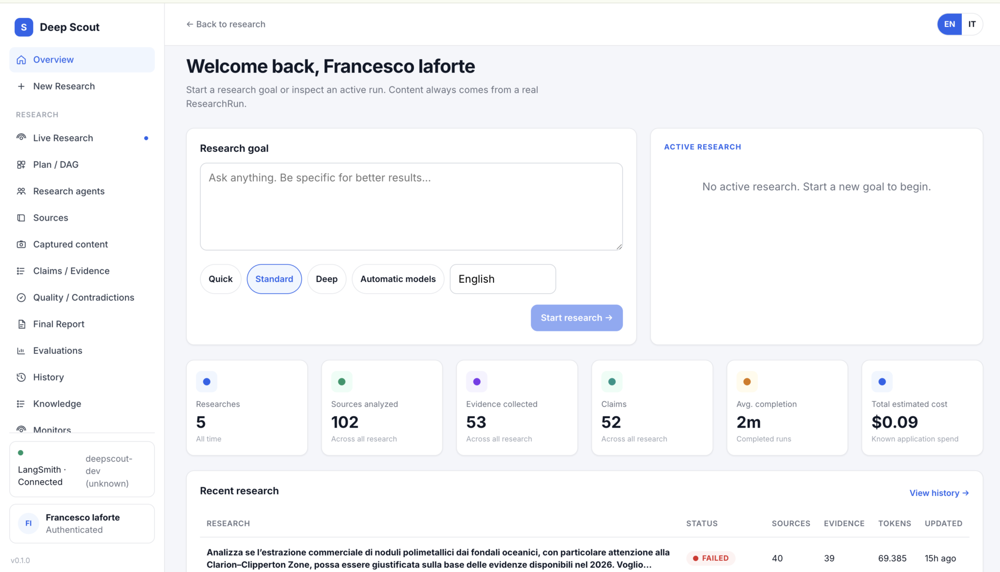
</p>

## Try it

| Path | What you get |
|------|----------------|
| [**Live app**](https://deep-scout-plum.vercel.app) | Hosted instance (MODE B): GitHub sign-in, BYOK provider keys |
| [**Explore demo**](https://deep-scout-plum.vercel.app/demo) | Five completed research runs, read-only, no signup, no provider spend while browsing |
| [**Sign in**](https://deep-scout-plum.vercel.app/login) | GitHub OAuth (Google when configured on the instance) |
| **Clone & run locally** | MODE A: no login, keys in `.env` — see [Local development](docs/local-development.md) |
| **Deploy your own** | [Self-hosting guide](docs/DEPLOYMENT.md) |

The public deployment splits **Vercel** (Next.js frontend) and a **persistent API + worker** (Railway in the reference setup) plus **PostgreSQL + pgvector**. One-click Vercel-only deploy is not supported — the worker and database are required.

## What it does

1. **Research goal** — Quick, Standard, or Deep mode; output language; optional model/region/freshness hints.
2. **Planning** — Semantic planner produces a task DAG with dependencies.
3. **Orchestration** — Python state machine runs phases under a hard `ResearchBudget`.
4. **Research agents** — LangChain `create_agent` per phase (plan, research, extract, critic, synthesis, report).
5. **Source discovery & fetch** — Tavily web search (v1 adapter); SSRF-safe HTTP fetch; HTML → text snapshots.
6. **Retrieval** — Run-scoped hybrid RAG: dense pgvector + Postgres FTS, fused with RRF, deterministic rerank.
7. **Claims & evidence** — Claims linked to snapshot quotes; provenance chain to sources.
8. **Quality** — Contradiction detection; deterministic quality checks on the run.
9. **Report** — Markdown report with citations rendered in the UI (not raw `**` / pipe tables).
10. **Evaluations** — 48 evaluator slots per run; deterministic results persisted; honest unavailable/skipped states.
11. **Hosted extras** — BYOK vault, tenant isolation, public demo catalog, optional LangSmith tracing.

Not included as production backends today: SPLADE, Neo4j GraphRAG, community GraphRAG, paid LLM rerankers (cross-encoder optional), or online RAGAS. Production hybrid retrieval uses **BM25 + Postgres FTS + dense pgvector** fused with RRF. See [AI & retrieval architecture](docs/architecture-overview.md) and [ADR-013](docs/architecture/adr/ADR-013-retrieval-upgrade.md).

## Screenshots

<p align="center">
  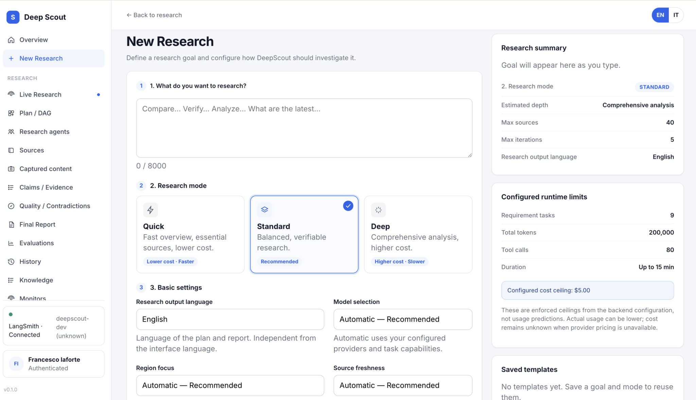
  &nbsp;
  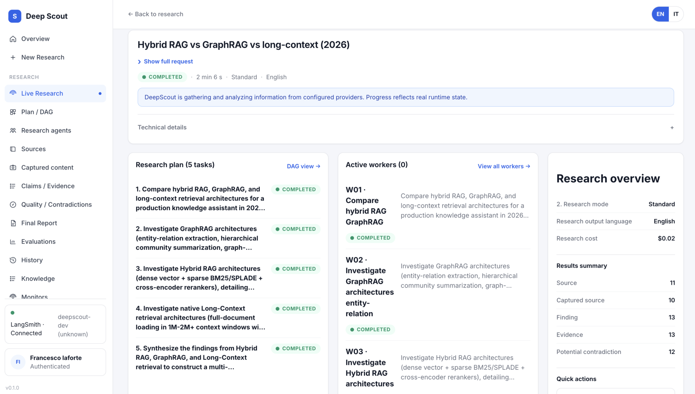
</p>

| Area | |
|------|---|
| Planning & agents | 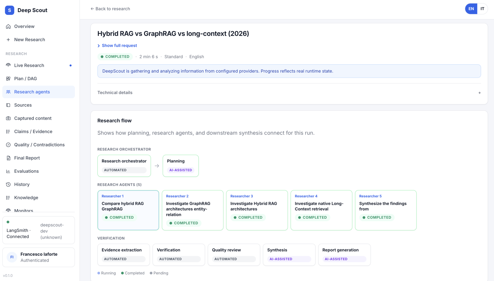 |
| Sources | Fetched URLs, pin/exclude, export CSV/JSON — 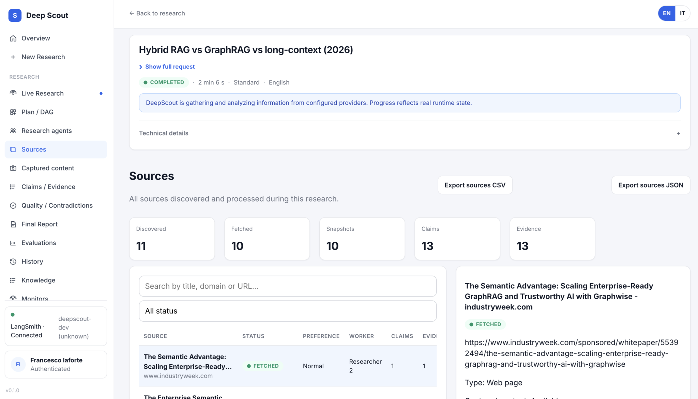 |
| Captured content | Snapshot text, content hash, linked evidence — 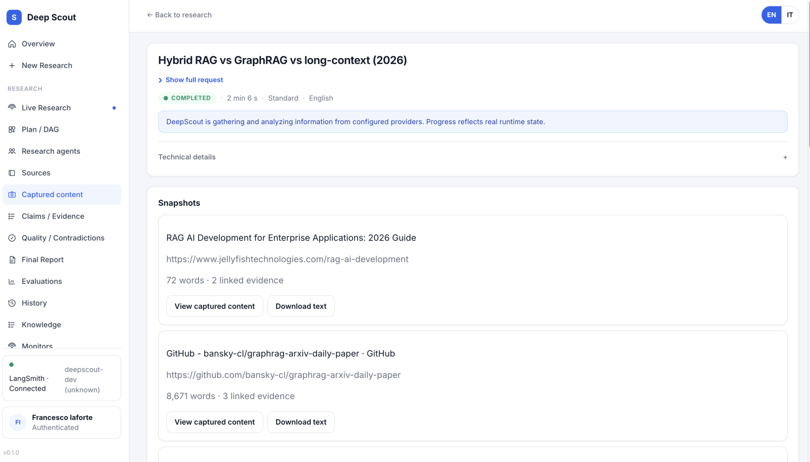 |
| Claims / evidence | Verified claims with quotes and source links — 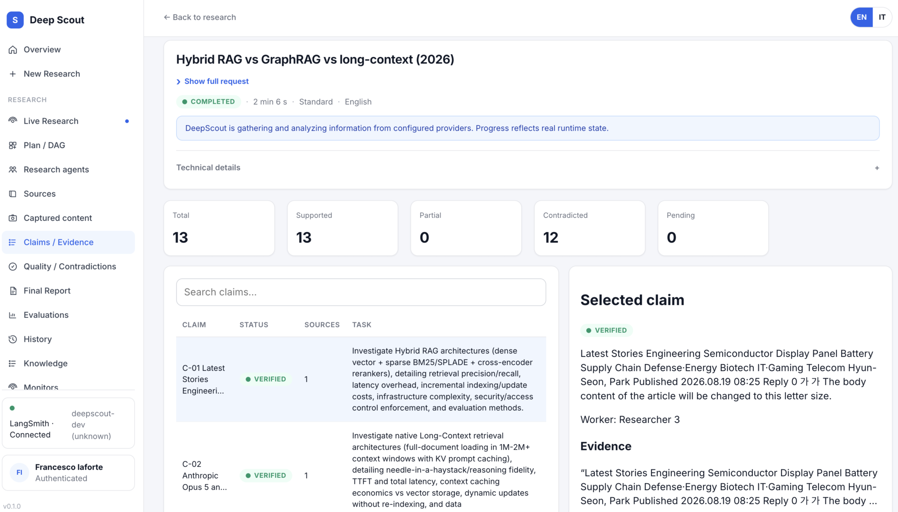 |
| Quality | Deterministic checks + contradiction cards — 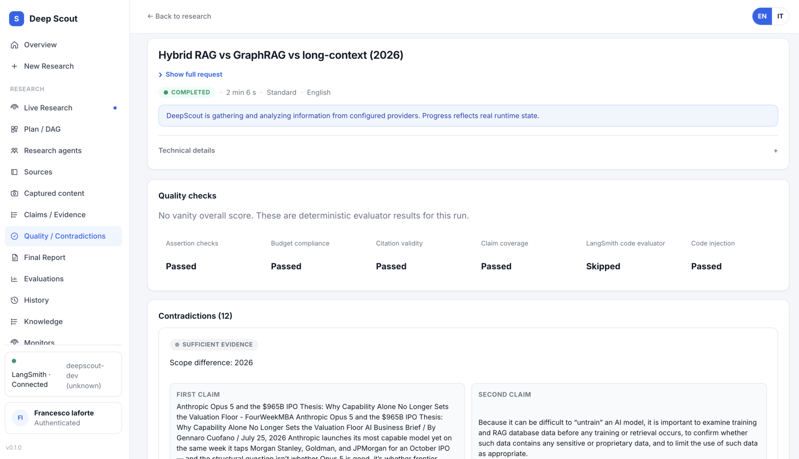 |
| Final report | Rendered Markdown, PDF/JSON export, follow-up — 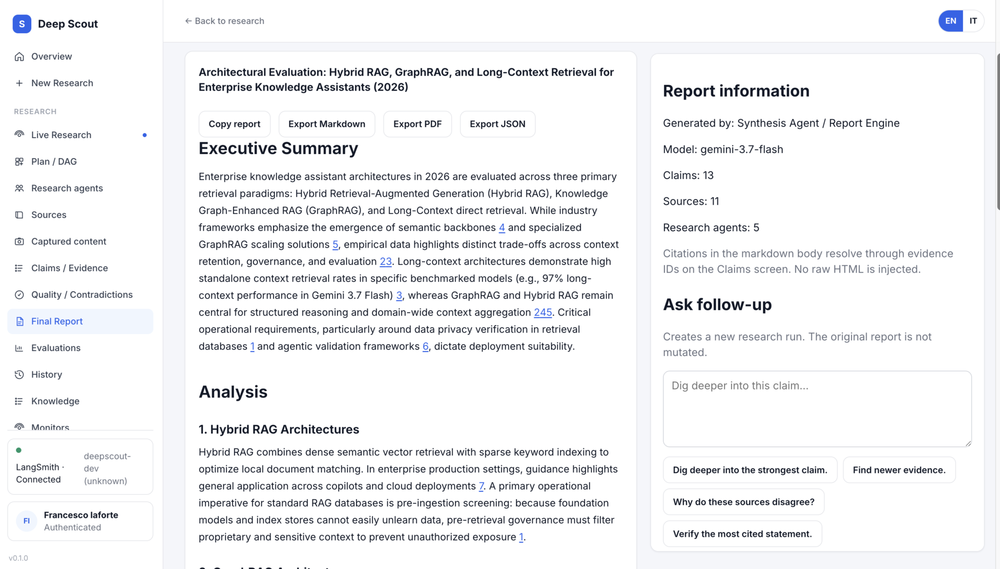 |
| Evaluations | Passed / score / skipped / unavailable per evaluator — 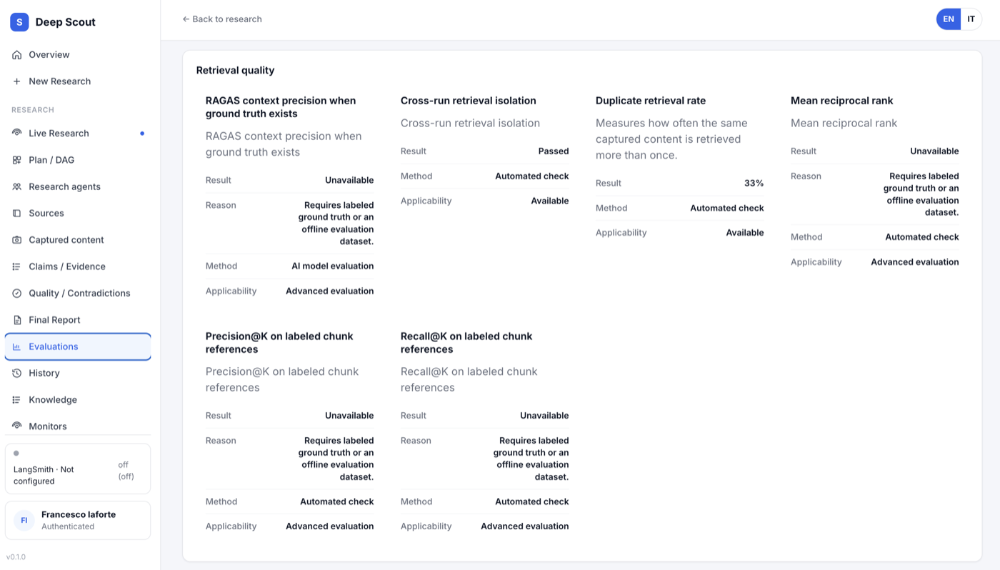 |
| Public demo | Read-only completed runs — 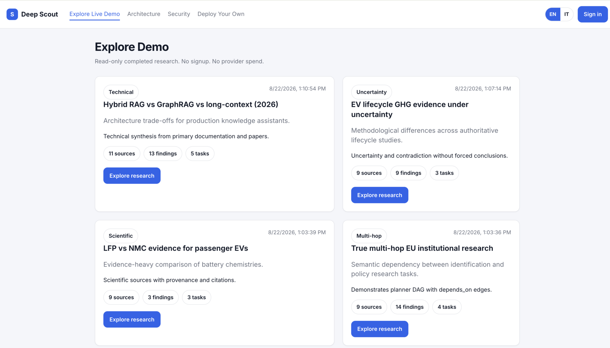 |

## Stack (summary)

| Layer | Technology |
|-------|----------------|
| Frontend | Next.js 15, React 19, TypeScript |
| API | FastAPI, SSE, OpenAPI at `/docs` when running locally |
| Worker | Same image as API; `DEEPSCOUT_PROCESS_ROLE=worker` |
| Orchestration | Custom Python orchestrator + LangChain agents + LangGraph (checkpoints, correction graphs) |
| Database | PostgreSQL 16 + pgvector; Alembic migrations |
| Retrieval | BM25 + Postgres FTS + dense pgvector → 3-way RRF → deterministic rerank |
| Auth (hosted) | GitHub/Google OAuth, session cookies, AES-GCM BYOK vault |
| Search | Tavily adapter (pluggable interface) |
| LLMs | Google Gemini, OpenAI, Anthropic via provider factory |
| Observability | LangSmith (opt-in; off by default for hosted users) |
| CI | GitHub Actions, CodeQL, Semgrep, Dependabot |

Full breakdown: [docs/architecture-overview.md](docs/architecture-overview.md) · [Agent runtime internals](docs/agent-runtime.md) · [Repository map](docs/repository-map.md)

## Agent runtime (short)

DeepScout separates **workflow authority** from **model assistance**:

```text
ResearchRun → Planner (structured LLM) → task DAG in Postgres
  → Orchestrator (Python state machine, budget + phases)
    → Workers (LangGraph: prepare → search → finalize per task)
      → Evidence pipeline → synthesis/report (structured LLM)
        → evaluations persisted at finalization
```

- **LangChain** — chat models, structured outputs, embeddings. Not the workflow engine.
- **LangGraph** — durable worker search subgraph + checkpoints. Postgres owns domain state.
- **Tools** — `web_search` only on workers today; allowlisted in code, not model-granted.

Details: [docs/agent-runtime.md](docs/agent-runtime.md)

## Quick start (local)

```bash
git clone https://github.com/francescoveryra-dot/deepscout.git
cd deepscout
cp .env.example .env
# Edit .env: at minimum GOOGLE_API_KEY and TAVILY_API_KEY for research

uv sync --all-packages --dev
docker compose -f infra/docker/docker-compose.yml up -d
cd libs/persistence && uv run alembic upgrade head && cd ../..

uv run deepscout-api          # terminal 1 — http://127.0.0.1:8000
cd apps/web && npm ci && npm run dev   # terminal 2 — http://localhost:3000
```

Details, troubleshooting, and Docker-only path: [docs/local-development.md](docs/local-development.md)

## Documentation

| Document | Description |
|----------|-------------|
| [docs/local-development.md](docs/local-development.md) | Prerequisites, env, DB, migrations, run, test |
| [docs/configuration.md](docs/configuration.md) | Environment variables |
| [docs/providers.md](docs/providers.md) | LLM/search keys, BYOK on hosted instances |
| [docs/DEPLOYMENT.md](docs/DEPLOYMENT.md) | MODE A/B, Vercel, Railway, migrations |
| [docs/public-instance.md](docs/public-instance.md) | Hosted app, demo, BYOK |
| [docs/troubleshooting.md](docs/troubleshooting.md) | Common problems |
| [docs/evaluations.md](docs/evaluations.md) | Evaluator registry, statuses, retrieval quality benchmark |
| [docs/architecture-overview.md](docs/architecture-overview.md) | System flow, AI/retrieval, deployment roles |
| [docs/agent-runtime.md](docs/agent-runtime.md) | Orchestrator, planner, workers, LangChain/LangGraph roles |
| [docs/repository-map.md](docs/repository-map.md) | Where code lives (for humans and coding agents) |
| [ARCHITECTURE.md](ARCHITECTURE.md) | Monorepo context and ADR index |
| [docs/architecture/](docs/architecture/) | Detailed design docs and ADRs |
| [SECURITY.md](SECURITY.md) | Vulnerability reporting |
| [CONTRIBUTING.md](CONTRIBUTING.md) | How to contribute |
| [AGENTS.md](AGENTS.md) | Instructions for coding agents |

## Development

```bash
bash scripts/scan-secrets.sh
uv run pytest -m "not integration"
cd apps/web && npm test && npm run build
```

## License

Apache License 2.0 — see [LICENSE](LICENSE).

## Author

Francesco Iaforte — [github.com/francescoveryra-dot](https://github.com/francescoveryra-dot)
