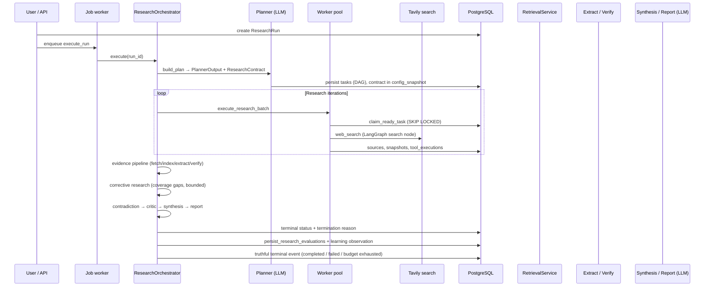
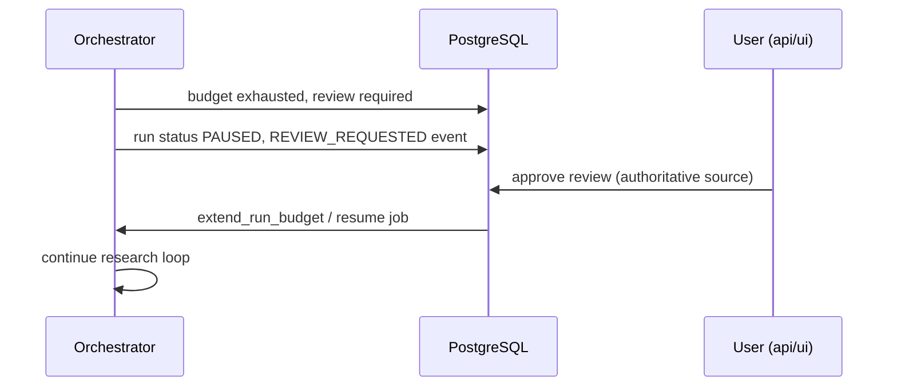

# Agent runtime internals

How DeepScout's research runtime actually works (v0.1.2). This document is derived from the current codebase, not from generic LangChain/LangGraph tutorials.

For a shorter overview see [architecture-overview.md](architecture-overview.md). For file locations see [repository-map.md](repository-map.md).

## Core idea

**The orchestrator is application authority.** LLMs assist specific phases with structured outputs. They do not own run lifecycle, tenancy, budgets, tool authorization, or persistence.

```text
PostgreSQL domain state  = source of truth (runs, tasks, evidence, budget, events)
LangGraph checkpoints    = worker search subgraph resume only (prepare → search → finalize)
```

---

## End-to-end flow



---

## 1. ResearchRun and configuration

A **ResearchRun** (`research_runs`) stores the goal, mode (quick/standard/deep), budgets, LLM provider/model, language, and `config_snapshot` JSON.

Important snapshot keys:

| Key | Set by | Purpose |
|-----|--------|---------|
| `research_contract` | Planner | Requirements, source constraints, evidence standard |
| `report_contract` | Planner | Report structure expectations |
| `coverage_map` | Corrective loop | Requirement coverage tracking |
| `verified_entities` | Entity verification gate | Unlocks dependent DAG tasks |

Contract schema v2 also stores explicit numeric constraints and conflicts. Allocation arithmetic in
report tables is checked deterministically; conflicting totals must be disclosed rather than silently
resolved by a model.

**Who decides lifecycle:** `ResearchOrchestrator.execute()` — not the model.

---

## 2. Planner and DAG

**Files:** `libs/research/.../planner.py`, `tasks/graph.py`, `runtime/plan_repair.py`

### Input

- Run goal, mode, language, optional follow-up context (untrusted DATA)
- Skill catalog snippet if `agent_skills_auto` enabled

### Output (`PlannerOutput`)

- `decomposition`: `simple` | `parallel` | `chain` | `mixed` | `unspecified`
- `tasks[]`: each with `task_key`, `objective`, `depends_on`, `allowed_tools`, `completion_criteria`, …
- `questions[]`: derived from tasks if missing
- Max **12 tasks** per plan

### ResearchContract

Built from planner output + goal. Persisted in `config_snapshot`. Drives:

- Source admission (`ONLY` / `EXCLUDE` / `PREFER` / `REQUIRE`)
- Coverage evaluation for corrective research
- Report contract alignment

User-authored bullets and material instruction clauses become separate requirements. Requirements
record central/secondary materiality, kind, comparison subjects, expected source classes, and
requested evidence types. Planner success criteria remain secondary synthesis guidance; they are not
a substitute for user requirements.

Requirement extraction uses token-aware intent matching: words such as `practical` or `impact` do
not imply a legal Act, references to AI models do not imply simulation evidence, and
`peer-reviewed` does not imply that a systematic review was requested. Source-only clauses and
requested task ordering are structural requirements. The latter is verified against the executed
DAG rather than against a web citation.

### DAG validation (deterministic + model-assisted)

1. LLM → `PlannerStructuredOutput` (`with_structured_output`)
2. If planner v2: **dependency validator** LLM → `DependencyValidatorOutput`
3. `repair_plan()`: dedupe objectives, remove invalid deps, break cycles via `TaskGraph.validate_dependencies()`
4. `contract_research_tasks()` may append specialized or fallback contract-driven tasks

When the validated planner already produced a semantic DAG, the runtime does not append one generic
task per user bullet. Contract-driven requirement tasks are a bounded fallback when no semantic task
plan exists; specialized entity/regulatory gates remain available. Search reformulations retain named
subjects from the full request instead of truncating context at the first comma.

### Example DAG (illustrative)

```text
T1: Compare hybrid RAG vs GraphRAG vs long-context
T2: Investigate GraphRAG architectures     depends_on [T1]
T3: Investigate Hybrid RAG architectures   depends_on [T1]
T4: Investigate long-context retrieval     depends_on [T1]
T5: Synthesize findings                    depends_on [T2, T3, T4]
```

`TaskGraph.ready_tasks()` returns tasks whose dependencies are `COMPLETED`. Entity tasks may additionally require `verified_entities` in config snapshot (`dependency_gate.py`).

---

## 3. Orchestrator

**File:** `libs/research/.../orchestrator.py`

### Controls (application-owned)

| Concern | Mechanism |
|---------|-----------|
| Phase order | Explicit calls: plan → research loop → evidence → finalize |
| Budget | `BudgetGate` + `evaluate_termination()` |
| Task scheduling | `TaskGraph.ready_tasks()` + worker pool claims |
| HITL pause | `HumanReviewService` → run status `PAUSED` |
| Replans | `evaluate_replan()` appends tasks; events `REPLAN_APPLIED` |
| Early stop | `evaluate_sufficiency()` (advisory; bounded reasons) |
| Tool allowlist | `WORKER_TOOL_ALLOWLIST` — today only `web_search` |
| Finalization | Terminal status + evaluation persistence |

### Does **not** delegate to models

- Tenancy / run ownership
- Budget minting or extension (except via HITL approve)
- Tool authorization
- Schema migrations
- Which phase runs next

### Research loop

`execute_research_batch()` until termination or no ready tasks with satisfied gates.

### Evidence pipeline

`FETCH → INDEX (embed chunks) → EXTRACT → VERIFY` on captured snapshots.

### Corrective research

**File:** `runtime/corrective_research.py`

1. `evaluate_coverage()` against `ResearchContract`
2. Diagnose the earliest visible gap stage (`not_searched`, search failure/no results, admission,
   fetch, extraction, attribution, numeric/comparison/source-portfolio gap, or budget exhaustion)
3. If a central gap is actionable, rounds are below the mode/operator cap, and budget allows →
   append requirement-specific gap tasks
4. Run research batch + incremental evidence pipeline
5. Record requirement/query/round trace in `config_snapshot`

Search-result admission also requires a named research-subject match. Named software architecture
tasks may be routed to stable official vendor documentation while broad comparison queries remain
open to independent papers. Evidence quotes must independently name the subject; a provider snippet
cannot validate unrelated page text.

Separate from **critic loop** (`_max_correction_rounds = 1`) used in finalize.

### Finalize phases

`CONTRADICTION → CRITIC (deterministic) → SYNTHESIS (LLM) → REPORT (LLM + final critic rewrites) → COMPILE_KNOWLEDGE (non-blocking)`

The final critic gates terminal success. A useful evidence-backed partial report may complete as
`completed_with_limitations`; zero admissible sources or zero evidence produce a failed,
evidence-blocked outcome; rewrite exhaustion remains a report failure. The terminal status and reason
are persisted first. `persist_research_evaluations()` then observes the real terminal state.

### Quick / Standard / Deep

All modes use the same material-completeness semantics. They differ only in bounded depth:

| Mode | Requirement tasks | Results/query | Corrective rounds | Gap queries/round | Report rewrites | Index tokens |
|------|-------------------|---------------|-------------------|-------------------|-----------------|--------------|
| Quick | 3 | 2 | 1 | 2 | 1 | 10,000 |
| Standard | 9 | 5 | 2 | 3 | 2 | 50,000 |
| Deep | 12 | 8 | 3 | 3 | 3 | 100,000 |

Quick budgets remain capped at 2 iterations / 8 sources / 16 tool calls. Standard uses the run's
normal budget (defaults: 5 / 40 / 80). Deep floors are 8 iterations / 60 sources / 120 tool calls.
One orchestration iteration drains every currently ready task; the worker allocation limit is an
admission bound, not a task-slice size. Database-writing workers within a run execute sequentially
because their task, event, source, usage, and budget rows share a PostgreSQL parent and must retain a
deterministic lock order. Separate durable run jobs may still execute on separate worker replicas.
Initial discovery reserves source capacity for the mode's corrective rounds. The cumulative indexing
allowance keeps embedding work from consuming the total run budget; lexical chunks remain available
when that allowance is exhausted. Operator settings remain hard upper bounds for corrective rounds,
gap fan-out, and rewrites.

### HITL pause / resume

When budget exhausted with unfinished work and `hitl_budget_extension_requires_review`:

- Creates `BudgetExtensionPayload` review with SHA-256 `payload_hash`
- Run → `PAUSED`, reason `awaiting_budget_extension`
- Resume only via authoritative approval (`api` / `ui` / `operator`)

Model text, retrieved content, and LangSmith feedback **cannot** approve reviews.

---

## 4. Workers vs agents vs tasks

| Term | Meaning in DeepScout |
|------|----------------------|
| **Task** | Row in `research_tasks` — unit of DAG work |
| **Worker** | Execution of one claimed task via LangGraph search subgraph |
| **Research agent** | UI label for a task/worker instance (Researcher 1, …) |
| **Orchestrator** | Python state machine driving phases |
| **AgentSpec** | Dataclass in `runtime/factory.py` — used in tests; production pool builds worker inline |
| **Skill** | Procedure text (SKILL.md) — no tool grants |
| **Tool** | Capability like `web_search` — allowlisted in code |

### Worker creation (production)

`ResearchWorkerPool` (`workers/pool.py`):

1. `claim_ready_task()` — `FOR UPDATE SKIP LOCKED`
2. `select_skills(objective, channel="task_objective")` — max 2 builtin skills
3. `run_worker_graph()` — LangGraph, not LangChain `create_agent`
4. Requires `web_search` in `task.allowed_tools`
5. On zero relevant/admissible yield, executes bounded subject-preserving reformulations; every
   attempt reserves tool budget and persists candidates/execution
6. Marks `COMPLETED` only after adding at least one admissible source; otherwise marks `BLOCKED`
7. Propagates terminal dependency blocks and persists an explicit checkpoint outcome

`BLOCKED` is terminal for the task graph but is not success. A stale checkpoint is recovered as
completed only when its explicit outcome is `completed`; `sources_added: 0` is never sufficient.

### Delegation / subagents

**File:** `runtime/delegation.py`

- `max_depth` from `agent_max_delegation_depth` (minimum 1)
- `max_children=2`, `max_total_workers` from settings
- `can_delegate()` blocks depth overflow and injection patterns like "spawn 100 agents"

**Normal path:** orchestrator → worker. Workers do **not** recursively spawn agent swarms in production.

`AgentFactory.build_worker_spec()` exists for tests; production bypasses it.

---

## 5. LangChain — actual role

LangChain is **not** the workflow engine.

| Used for | Not used for |
|----------|--------------|
| `BaseChatModel` via provider factory | Run lifecycle |
| `with_structured_output()` on planner, validator, synthesis, report | Tenancy |
| `Embeddings` for chunk indexing | Budget decisions |
| Smoke agent (`create_agent` in `smoke_agent.py` only) | HITL authorization |
| | Worker web search loop (direct Tavily call in LangGraph node) |

### Structured-output phases

| Phase | Schema |
|-------|--------|
| Planner | `PlannerStructuredOutput` |
| Dependency validator | `DependencyValidatorOutput` |
| Synthesis | `SynthesisOutput` |
| Report | `ReportSynthesisOutput` |

**Critic phase:** deterministic checks in `phases/critic.py` — not LLM-judge by default.

### Retries

Application `run_with_retry()` wraps LLM calls. Provider transport: `PROVIDER_TRANSPORT_MAX_RETRIES = 0` in `deepscout_providers/config.py` — no nested LangChain retry amplification.

---

## 6. LangGraph — actual role

### Worker graph (`workers/langgraph_worker.py`)

```text
prepare → search → finalize
```

- **prepare:** build query from task objective
- **search:** `search_provider.search(query, max_results=3)`
- **finalize:** write results to store

Checkpoint: `PostgresSaver` or `MemorySaver`. Thread ID: `{run_id}:{task_id}`.

**Resume:** if worker crashes mid-graph, LangGraph can resume search state. Task completion and domain artifacts remain authoritative in Postgres.

### Correction graph (`graphs/correction.py`)

`validate → (critic if failed) → finalize` for bounded artifact correction. Critic step is deterministic in `_run_critic`.

### What LangGraph does **not** own

- Research run status
- Task DAG edges
- Claims, evidence, sources
- Budget ledger
- SSE `run_events`

---

## 7. Prompt architecture

**Files:** `libs/research/.../prompts/`

Layers in `compose_runtime_context()`:

| Layer | Trust | Content |
|-------|-------|---------|
| `GLOBAL_POLICY_V1` | Trusted | Invariants, injection resistance |
| Phase `PromptSpec` | Trusted | Role instructions |
| `domain_state` | Trusted | Structured run/task fields |
| `retrieved_data` | **Untrusted DATA** | Snapshot excerpts, search snippets |
| `skill_instructions` | Trusted (builtin only) | Selected SKILL.md bodies |
| `working_state` | Bounded | Scratch summaries |

Retrieved web content is never promoted to system policy.

### Registered prompts

| ID | Role |
|----|------|
| `planner` v2 | Task decomposition |
| `planner_dependency_validator` v1 | Semantic dependency validation |
| `research_worker` v1 | Worker objective framing (graph uses direct search) |
| `extractor` v1 | Claim/evidence extraction |
| `verifier` v1 | Verification instructions |
| `critic` v1 | Critic spec (deterministic execution) |
| `synthesis` v1 | Narrative synthesis |
| `report` v1 | Final report structure |

Full prompt text lives in `prompts/registry.py` — link there instead of duplicating in docs.

Malformed structured output: retry via `run_with_retry`; persistent failure surfaces as phase error / run failure paths.

---

## 8. Context engineering

**File:** `context.py`, `runtime/compaction.py`

`ContextAssembly` fields:

- `system_policy`, `phase_instructions` — trusted
- `retrieved_data` — compacted snapshot/search text
- `working_state` — task-local scratch
- `artifact_refs` — pointers to persisted artifacts
- `skill_instructions` — selected skills

`ContextBudget`: default `max_input_tokens=8000`, `output_reserve=1024`, ratio splits for retrieved/working/history.

`isolate_worker()` — worker sees task slice only, not full run trace.

`compact()` — deterministic dedupe/truncate; summaries are **not** evidence.

---

## 9. Memory layers

| Layer | Storage | Authority | Notes |
|-------|---------|-----------|-------|
| **Working memory** | In-process `WorkingMemory` | Transient | Tool summaries (max 8), scratch dict |
| **Agent notes** | `agent_notes` table | Persisted, advisory | DECISION, OPEN_QUESTION, RISK, … |
| **Run events** | `run_events` | Audit / SSE | No chain-of-thought in UI |
| **Task checkpoint** | `research_tasks.checkpoint` JSON | Resume metadata | Worker progress |
| **Evidence** | `evidence` + `claims` | **Authoritative** for citations | Quote must resolve to snapshot |
| **SourceSnapshot** | `source_snapshots` | **Primary captured text** | Content hash, mime |
| **Compiled knowledge** | Wiki pages/statements | Derived, provenance-linked | Built after report; not primary evidence |

No cross-user or cross-run conversational memory. Follow-up runs may inject prior context as untrusted DATA in config snapshot.

---

## 10. Skills

**Builtin skills** (`skills/builtin/`):

- `citation-audit`
- `contradiction-analysis`
- `evidence-gap-analysis`

Format: YAML frontmatter (`name`, `description`, `compatibility` triggers) + markdown body.

**Selection** (`skills/router.py`):

- Channel must be `task_objective` (trusted)
- Score by slug (+3) and keyword triggers (+2)
- Return top 2

Skills cannot grant tools (`tools/registry.py` ignores skill tool requests).

---

## 11. Tools

**Allowlist:** `WORKER_TOOL_ALLOWLIST = {"web_search"}`

**ToolRegistry** classifies requests:

- Unknown → `DENY`
- Destructive / external write → `REQUIRE_REVIEW` (HITL)

Worker execution: LangGraph `_search` node calls Tavily directly — not a multi-tool ReAct loop.

**MCP:** not implemented as self-authorizing remote tool discovery in the worker path.

---

## 12. Model routing

**File:** `routing/model_router.py`

- `resolve(role)` → primary provider/model from settings or `AgentModelPolicy`
- `select_with_fallback()` — checks capabilities + `ProviderHealthRegistry` (in-process cooldown after failures)
- `build_chat_model()` → LangChain chat model

Embedding spaces are not silently swapped — embedding model tied to indexing configuration.

---

## 13. Budget system

**ResearchBudget** defaults (overridable per run): iterations, wall time, tokens, cost USD, sources, tool calls.

`BudgetGate.reserve_*()` writes ledger entries under row lock (`FOR UPDATE`). Workers cannot mint budget.

Exhaustion paths:

- Stop with `BUDGET_EXHAUSTED`
- Optional HITL budget extension review
- Optional finalize-on-exhaustion if `research_finalize_on_budget_exhausted`

---

## 14. Search → citation pipeline

```text
task objective
  → web_search (Tavily)
  → URL discovery
  → source admission (contract + PIN/EXCLUDE/ONLY + SSRF fetch guard)
  → SourceSnapshot (HTML→text, content_hash)
  → chunk + embed (INDEX phase)
  → hybrid retrieval (BM25 + Postgres FTS + dense pgvector → 3-way RRF → deterministic rerank)
  → EXTRACT: Claim + Evidence (quote)
  → VERIFY: verification_status on claims
  → REPORT: citations resolve to evidence IDs
```

### Source preferences

- User **PIN/EXCLUDE** on sources (`source_policy.py`) — EXCLUDE wins
- Contract **ONLY/REQUIRE/EXCLUDE** on domains/classes (`contracts/source_authority.py`)

---

## 15. Evidence and provenance

```text
Source (canonical_url)
  → SourceSnapshot (content_text, content_hash)
    → Evidence (quote, snapshot_id)
      → Claim (statement, verification_status)
```

Report citations link to evidence/claims in the UI — not raw model prose.

Compiled wiki statements are derived; they do not replace snapshot-backed evidence.

---

## 16. Contradictions and quality

- **Contradiction detection** during CONTRADICTION phase — groups conflicting claims
- **Critic** — deterministic checks (budget, citations, coverage signals)
- **Quality screen** — mixes deterministic evaluator results + contradiction cards
- UI does not show a vanity "overall score"

---

## 17. Evaluations

At finalization: `persist_research_evaluations()` → `evaluation_results` table.

53 registry slots; online deterministic checks + honest `unavailable` for offline/ground-truth evaluators.

LangSmith experiments (`scripts/langsmith_*`) are **operator observability** — separate from product evaluation rows.

See [evaluations.md](evaluations.md) and [architecture/CONTINUOUS_LEARNING.md](architecture/CONTINUOUS_LEARNING.md).

### Effective runtime policy

At run creation the API resolves promoted policies per family (`policy_resolver.py`) and freezes them in `config_snapshot["learning_policies"]`. Workers read the **snapshot**, not live DB rows.

Precedence:

```text
1. HARD_BOUNDS + hook-site caps (always win)
2. Run / user constraints (budget, contract, tool allowlists)
3. Active promoted policy (global, scoped, or tenant-local)
4. FAMILY_BASELINES defaults
→ EffectiveRuntimePolicy
```

Adaptive knobs (retrieval, planner, synthesis, etc.) cannot override auth, tenant isolation, SSRF, evidence provenance, HITL authority, or absolute budget ceilings.

---

## 18. Streaming (SSE)

```text
orchestrator._emit() → run_events row
  → COMMIT → pg_notify('deepscout_run_events', run_id)
    → API LISTEN → SSE to browser
```

`GET /api/v1/research-runs/{id}/events?after=` replays by sequence. Disconnect does not cancel the run.

Event types include `PHASE_*`, `TASK_READY`, `WORKER_STARTED`, `SKILL_SELECTED`, `RUN_PAUSED`, `REVIEW_REQUESTED`, `RUN_COMPLETED`. No chain-of-thought in product events.

---

## 19. Jobs, leases, recovery

**Job queue** (`research_jobs`):

- `claim_next_job` — `FOR UPDATE SKIP LOCKED`, lease token + expiry
- Worker runs `ResearchOrchestrator.execute()` or resume path
- Stale lease → job returns to `PENDING`

**Browser closed:** run continues on worker.

**API/worker restart:** jobs reclaimed via lease expiry; LangGraph may resume in-flight worker search subgraph.

**Cancelled run:** cooperative checks raise `RunCancelledError` (non-retryable).

---

## 20. HITL sequence



---

## 21. Tenancy and BYOK

- Runs scoped to `owner_principal_id`
- Unauthorized access → 404
- Public demos: `public_slug` + explicit published flag
- User provider keys: AES-GCM vault, decrypted only server-side for provider calls

See [providers.md](providers.md) and [SECURITY.md](../SECURITY.md).

---

## 22. Implementation map

| Concern | Main implementation |
|---------|---------------------|
| Orchestrator | `libs/research/src/deepscout_research/orchestrator.py` |
| Planner | `libs/research/src/deepscout_research/planner.py` |
| Task DAG | `libs/research/src/deepscout_research/tasks/graph.py` |
| Plan repair | `libs/research/src/deepscout_research/runtime/plan_repair.py` |
| Worker pool | `libs/research/src/deepscout_research/workers/pool.py` |
| LangGraph worker | `libs/research/src/deepscout_research/workers/langgraph_worker.py` |
| Checkpointer | `libs/research/src/deepscout_research/workers/checkpointer.py` |
| Context | `libs/research/src/deepscout_research/context.py` |
| Prompts | `libs/research/src/deepscout_research/prompts/` |
| Skills | `libs/research/src/deepscout_research/skills/` |
| Tools | `libs/research/src/deepscout_research/tools/registry.py` |
| Model router | `libs/research/src/deepscout_research/routing/model_router.py` |
| Retry | `libs/research/src/deepscout_research/retry.py` |
| Budget | `libs/research/src/deepscout_research/budget.py` |
| HITL | `libs/research/src/deepscout_research/hitl/` |
| Corrective research | `libs/research/src/deepscout_research/runtime/corrective_research.py` |
| Retrieval | `libs/research/src/deepscout_research/retrieval/` |
| Phases | `libs/research/src/deepscout_research/phases/` |
| Job worker | `libs/research/src/deepscout_research/jobs/worker.py` |
| Store / events | `libs/persistence/src/deepscout_persistence/store.py` |
| Evaluations | `libs/evaluation/src/deepscout_evaluation/` |
| API SSE | `apps/api/src/deepscout_api/routes/research_runs.py` |

---

## Related ADRs

- [ADR-002 LangChain agent runtime](architecture/adr/ADR-002-langchain-agent-runtime.md)
- [ADR-004 Bounded research loop](architecture/adr/ADR-004-bounded-research-loop.md)
- [ADR-008 Hybrid retrieval](architecture/adr/ADR-008-hybrid-retrieval.md)
- [ADR-011 HITL control plane](architecture/adr/ADR-011-hitl-control-plane.md)
- [ADR-012 Agent runtime](architecture/adr/ADR-012-agent-runtime.md)

**Note:** ADR-012 describes `AgentFactory` as the worker path; production currently uses `ResearchWorkerPool` + LangGraph directly. `create_agent` remains smoke-test only.
