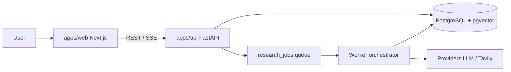
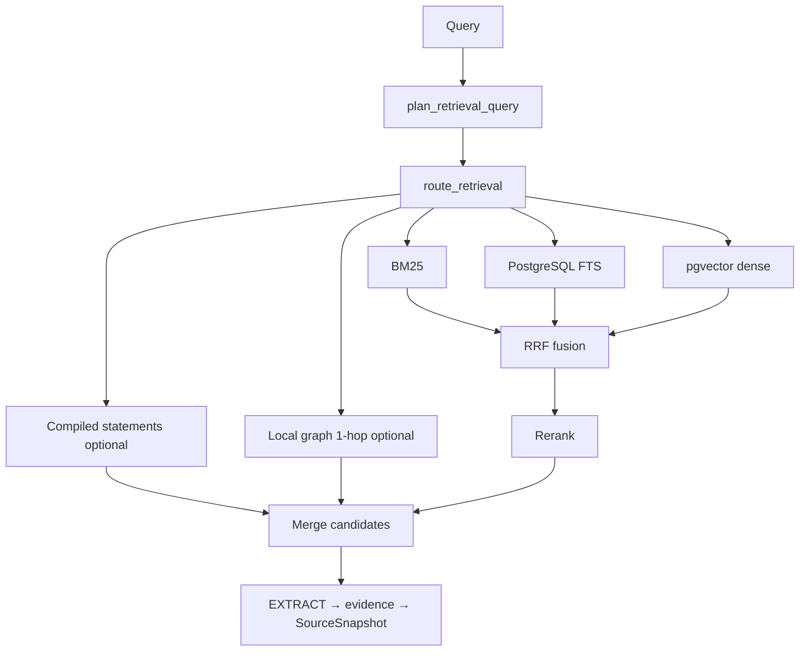

# Architecture overview

High-level map of how DeepScout works today (v0.1.0). For ADRs and deep dives see [docs/architecture/](architecture/) and [ARCHITECTURE.md](../ARCHITECTURE.md).

## Request flow



Hosted production adds OAuth sessions and encrypted BYOK credentials on the API/worker path. The browser talks to the frontend origin; Next.js rewrites `/api` to the persistent backend.

## Research lifecycle

```text
Goal submitted
  → Research run created (budget, mode, language)
  → Worker: PLAN (semantic planner → task DAG)
  → RESEARCH (agents + web search + fetch)
  → COLLECT / INDEX (chunks + embeddings per run)
  → EXTRACT (claims + evidence quotes)
  → VERIFY / CONTRADICTION
  → COMPILE_KNOWLEDGE (run-scoped compiled knowledge, LLM-wiki style pages)
  → CRITIC / SYNTHESIS
  → REPORT (cited Markdown)
  → Finalize → persist evaluation_results (deterministic evaluators)
```

Phases are owned by `libs/research/src/deepscout_research/orchestrator.py`. Each phase can invoke LangChain agents with an allowlisted tool set.

## Retrieval path (hybrid)



See [RAG_PIPELINE.md](architecture/RAG_PIPELINE.md) and [ADR-013](architecture/adr/ADR-013-retrieval-upgrade.md). Quality measurement: `scripts/retrieval_quality_benchmark.py`.

## AI & retrieval — what is actually implemented

| Capability | Status | Notes |
|------------|--------|-------|
| LangChain agents per phase | **Implemented** | `create_agent`, structured outputs |
| LangGraph | **Implemented** | Checkpoints, correction subgraphs — not the main planner DAG |
| Hybrid retrieval (dense + lexical) | **Implemented** | pgvector + **BM25** + Postgres FTS → 3-way RRF; deterministic rerank |
| BM25 | **Implemented** | Okapi BM25 in `retrieval/bm25.py`; separate from Postgres FTS |
| SPLADE | **Not implemented** | Rejected after evaluation — BM25+dense sufficient for run-scoped corpora |
| Cross-encoder rerank | **Optional** | `RERANKER_MODE=cross_encoder` + `deepscout-research[rerank]`; default deterministic |
| Adaptive retrieval router | **Implemented** | `retrieval/router.py` — intent-based retriever mix |
| Contextual retrieval | **Implemented** | `context_text` for embeddings; evidence `text` unchanged |
| GraphRAG (communities) | **Not implemented** | Local `knowledge_relations` graph search only |
| Graph retrieval (local) | **Implemented** | Entity match + 1-hop over `knowledge_relations` |
| LLMWiki in retrieval | **Implemented** | `corpus=compiled|both` merges wiki statements (not evidence) |
| Long-context model window | **Uses provider context** | Not a separate retrieval mode in code |
| Compiled knowledge (LLM Wiki) | **Implemented** | Run-scoped knowledge pages/statements |
| RAGAS metrics | **Offline optional** | `ragas_eval.py` imports optionally; registry marks offline-only |
| LangSmith | **Integrated, opt-in** | Tracing spans; hosted users default OFF |
| Multi-provider LLM | **Implemented** | Factory in `libs/providers` |
| Evaluation persistence | **Implemented** | `evaluation_results` table, migration 012 |

Default retrieval mode: `hybrid` with deterministic rerank (`RETRIEVAL_MODE` env: `lexical`, `dense`, `hybrid`).

Indexing path: source snapshot → recursive chunks → embeddings → `chunk_embeddings`, scoped by `research_run_id`.

## Security boundaries

| Boundary | Mechanism |
|----------|-----------|
| Hosted auth | OAuth + session cookie |
| Run access | `owner_principal_id` match; demo via `public_slug` |
| Fetch | SSRF checks, private IP blocking, size limits |
| BYOK | AES-GCM vault; decrypt only in worker/API for provider calls |
| Markdown UI | `rehype-sanitize` on rendered report/content |
| Tools | Allowlist per task; not model-granted |

## Deployment roles

| Process | Env | Role |
|---------|-----|------|
| `api` | `DEEPSCOUT_PROCESS_ROLE=api` (default) | HTTP, SSE, auth |
| `worker` | `DEEPSCOUT_PROCESS_ROLE=worker` | Job consumer, orchestrator execution |

Same Docker image (`infra/docker/Dockerfile.api`); entrypoint in `infra/docker/entrypoint.sh`.

## Reference public deployment

This is how the maintainer runs the public instance — not a hard requirement for self-hosters:

| Component | Reference host |
|-----------|----------------|
| Frontend | Vercel (`deep-scout` project) |
| API + worker | Railway |
| Database | Managed PostgreSQL (Supabase in reference setup) |

Any host that can run Docker + Postgres + persistent worker is fine.

For detailed design on orchestration, LangChain/LangGraph boundaries, prompts, and workers see [agent-runtime.md](agent-runtime.md).

## Further reading

- [RAG_PIPELINE.md](architecture/RAG_PIPELINE.md) — indexing and hybrid retrieval detail
- [RESEARCH_LIFECYCLE.md](architecture/RESEARCH_LIFECYCLE.md) — phase definitions
- [PROVIDER_ARCHITECTURE.md](architecture/PROVIDER_ARCHITECTURE.md) — LLM factory
- [011-mode-b-hosted.md](adr/011-mode-b-hosted.md) — hosted auth and BYOK
- [evaluations.md](evaluations.md) — evaluator semantics
