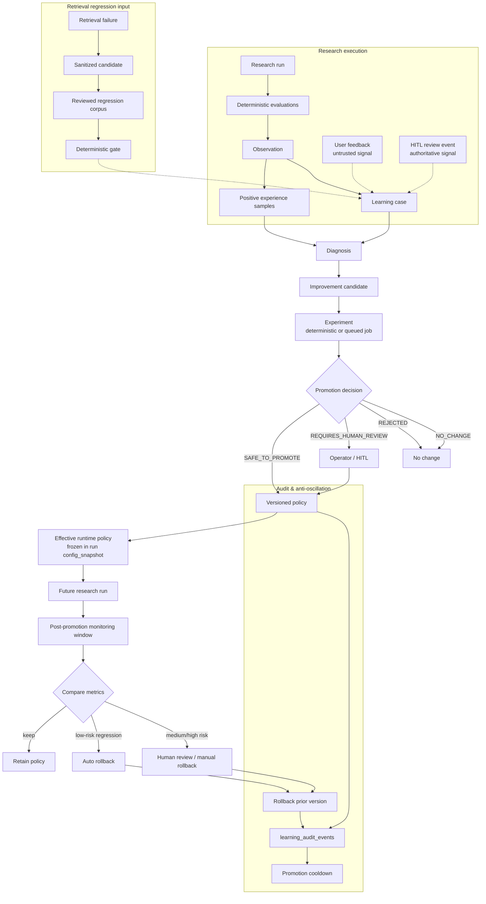

# Continuous learning architecture

How DeepScout adapts **versioned runtime policies** from evaluated experience — without autonomous code mutation, cross-tenant leakage, or overriding fixed security invariants.

DeepScout does **not** “train itself.” It observes terminal runs, diagnoses failures, runs bounded experiments, and may promote **typed policy deltas** that influence future runs under hard application bounds. Actual improvement requires promotion **and** post-promotion measurement.

See also [ADR-018](adr/ADR-018-continuous-learning.md) and [evaluations.md](../evaluations.md).

---

## End-to-end flow



---

## Adaptive policy layer (9 families)

Learning may adjust **bounded knobs** per family. All values are clamped by `HARD_BOUNDS` in `policy_families.py` and enforced again at hook sites.

| Family | Example knobs | Runtime hook | Promotion risk |
|--------|---------------|--------------|----------------|
| `corrective_research` | `gap_queries_per_round_bonus` | `corrective_research.py` | Low — auto eligible |
| `retrieval` | `retrieval_top_k_delta`, `retrieval_candidate_k_multiplier` | `phases/extract.py` | Low |
| `query_strategy` | `search_variant_count_delta`, `zero_yield_reformulation_bonus` | `workers/pool.py` | Low |
| `allocation` | `allocation_parallel_preference` | `runtime/allocation.py` | Medium — HITL |
| `sufficiency` | threshold deltas | `runtime/sufficiency.py` | Low |
| `synthesis` | `report_rewrite_bonus` | `orchestrator.py` | Medium — HITL |
| `reasoning` | `reasoning_effort_level` | `routing/model_router.py` | Medium — HITL |
| `planner` | `max_tasks_bonus`, `planner_decomposition_strictness` | `planner_policy.py` | Medium — HITL |
| `cost_latency` | `prefer_lower_cost_strategy` | model routing fallback | Low |

Scoped retrieval policies use keys like `global.retrieval.semantic` without affecting identifier retrieval.

---

## Effective runtime policy resolution

Precedence (from `policy_resolver.py`):

```text
1. Application hard bounds (HARD_BOUNDS + hook-site caps)     ← always wins
2. Run / user constraints (budget, contract, tool allowlists) ← never overridden by learning
3. Active promoted policy (global, scoped, or tenant-local)   ← versioned in DB
4. Family baselines (FAMILY_BASELINES defaults)               ← fallback
→ EffectiveRuntimePolicy → frozen in config_snapshot["learning_policies"] at run start
```

At run creation the API snapshots `learning_policy_versions` + `effective` payloads. Workers read the **frozen** snapshot — not live DB — for reproducibility.

---

## Fixed security invariants (non-adaptive)

```mermaid
flowchart LR
  subgraph Adaptive["Adaptive policy layer"]
    AP[Promoted policy deltas]
  end

  subgraph Fixed["Fixed security invariants"]
    F1[Authentication & authorization]
    F2[Tenant isolation]
    F3[Secrets / BYOK encryption]
    F4[SSRF / secure fetch]
    F5[CSRF / CORS]
    F6[Tool allowlists]
    F7[Evidence provenance / SourceSnapshot authority]
    F8[HITL operational authority]
    F9[Absolute budget ceilings]
    F10[Public demo read-only]
    F11[Code / deployment authority]
  end

  AP -.->|cannot override| Fixed
```



User feedback and HITL learning signals **do not** change security policy. They create learning cases with appropriate trust levels only.

---

## Signal trust boundaries

| Signal | Trust | May auto-promote? |
|--------|-------|-------------------|
| Terminal evaluator failure | `sanitized_candidate` | No — experiment + gate |
| Positive experience (successful runs) | `sanitized_candidate` | No — opportunity case only |
| User feedback | `untrusted_observation` | No |
| HITL review event | `reviewed_case` | No — informs diagnosis |
| Controlled experiment | `validated_learning` | Low-risk families only, with samples |
| Operator approval | `promoted_policy` | Yes, after gate |

---

## Tenant vs global learning

```text
Tenant A experience → tenant-scoped policies only (policy_key tenant.*)
Global promotion → owner_principal_id IS NULL + sanitized generalized evidence + operator approval when required
```

Cross-tenant contamination is rejected by store scoping and tests.

---

## Learning ≠ promotion

```text
PROMOTION → future runs → monitoring window → measurement → RETAIN | ROLLBACK | HITL REVIEW
```

Effectiveness analytics (`/api/v1/learning/effectiveness`) reads persisted aggregates only — **no provider calls** from the dashboard.

---

## Persistence (migration 016)

| Table | Role |
|-------|------|
| `learning_cases` | Diagnosed failures and opportunities |
| `improvement_candidates` | Proposed policy deltas |
| `learning_policy_versions` | Versioned active policies |
| `learning_audit_events` | Promotion, rollback, experiment audit |
| `learning_experience_samples` | Positive experience aggregation |
| `learning_policy_monitoring` | Post-promotion observation windows |
| `learning_experiment_jobs` | Durable async experiment queue |

Hosted `/ready` expects Alembic head **016**.

---

## UI

Authenticated owners: `/learning` — metrics, cases, candidates, policies, audit, effectiveness overview, approve/reject/rollback. Public demos cannot access private learning data.

---

## CI gates

| Gate | Command |
|------|---------|
| Learning loop | `uv run python scripts/learning_loop_gate.py` |
| Learning effectiveness fixtures | `uv run python scripts/learning_effectiveness_gate.py` |
| Retrieval regression | `uv run python scripts/retrieval_regression_gate.py` |
