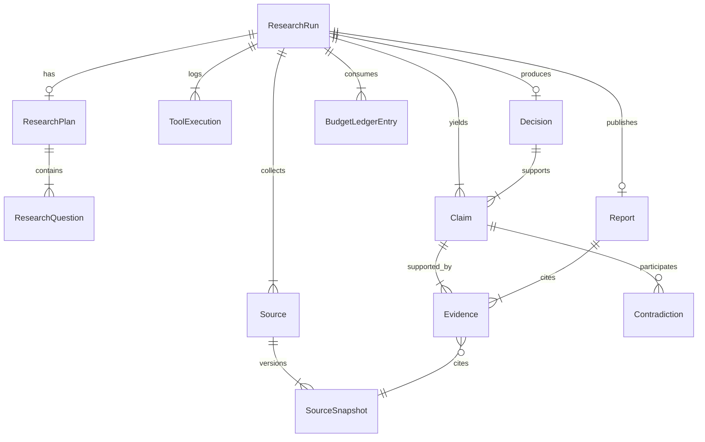

# Data Model

PostgreSQL is the source of truth for the research domain. Redis caches ephemeral runtime state only. pgvector complements relational storage for semantic retrieval in later phases; it does not replace entities or provenance.

## Aggregate root

`ResearchRun` is the aggregate root for a single autonomous research execution. It owns budget limits, provider/model audit fields, lifecycle status, and relationships to plans, sources, claims, tool executions, decisions, and reports.

## Entity distinctions

| Entity | Role | Not the same as |
|---|---|---|
| `Source` | Logical identity of a reference (URL, upload, manual note) | A snapshot, claim, or evidence |
| `SourceSnapshot` | Immutable observation of source content at retrieval time | The live web page or mutable source row |
| `Claim` | Extracted statement subject to verification | Evidence or a final decision |
| `Evidence` | Quote/locator tying a claim to a specific snapshot | The claim itself or the source URL alone |
| `Contradiction` | Structured conflict between two claims | A generic error or unsupported claim |
| `Decision` | Recommendation derived from verified claims | A claim or report body |
| `Report` | Human-readable synthesis with cited evidence rows | Raw evidence text or the decision rationale alone |

## Lifecycle taxonomies

### ResearchRun

`pending` → `running` → (`paused` optional) → terminal:

- `completed`
- `failed`
- `cancelled`
- `budget_exhausted`

Terminal runs cannot implicitly restart to `running`.

### ResearchQuestion

`pending` → `researching` → `answered` | `insufficient_evidence` | `skipped`

### Claim verification

`pending` → `supported` → `verified` | `partially_verified` | `refuted` | `insufficient_evidence`

Verified statuses require at least one evidence row.

## Domain invariants (enforced in code)

1. A claim without evidence cannot be `verified` or `partially_verified`.
2. Evidence must reference a real `SourceSnapshot`.
3. `SourceSnapshot` content is immutable; content changes create a new snapshot row keyed by `(source_id, content_hash)`.
4. Decisions may reference only `verified` or `partially_verified` claims.
5. Reports must cite evidence rows via `report_evidence`.
6. Contradictions must link two claim IDs.
7. Budget counters cannot go negative; ledger entries are append-only.
8. Provider/model used for a run are stored on `research_runs` for audit.

## Budget

`ResearchBudget` limits per run:

- `max_iterations`
- `max_wall_time_seconds`
- `max_total_tokens`
- `max_cost_usd`
- `max_sources`
- `max_tool_calls`

`BudgetLedgerEntry` records actual consumption deltas. Enforcement is deterministic in application code, not delegated to the LLM.

## pgvector decision (Phase 2)

Migration `001` enables the `vector` extension only. No embedding table is created yet because provider/model dimensions differ (Google `gemini-embedding-2` vs OpenAI `text-embedding-3-small`). Vector tables arrive in Phase 5 with an explicit `(provider, model, dimensions)` strategy.

## Layering

- **Domain (Pydantic/dataclasses)** — `libs/core/src/deepscout_core/domain/`
- **Persistence (SQLAlchemy)** — `libs/persistence/src/deepscout_persistence/models.py`
- **Store** — focused write/read operations in `store.py`, no generic CRUD base class
- **API** — thin HTTP adapters in `apps/api/src/deepscout_api/routes/`

LangChain remains outside entity definitions; it will orchestrate intelligence in later phases without owning domain state.

## ER diagram

