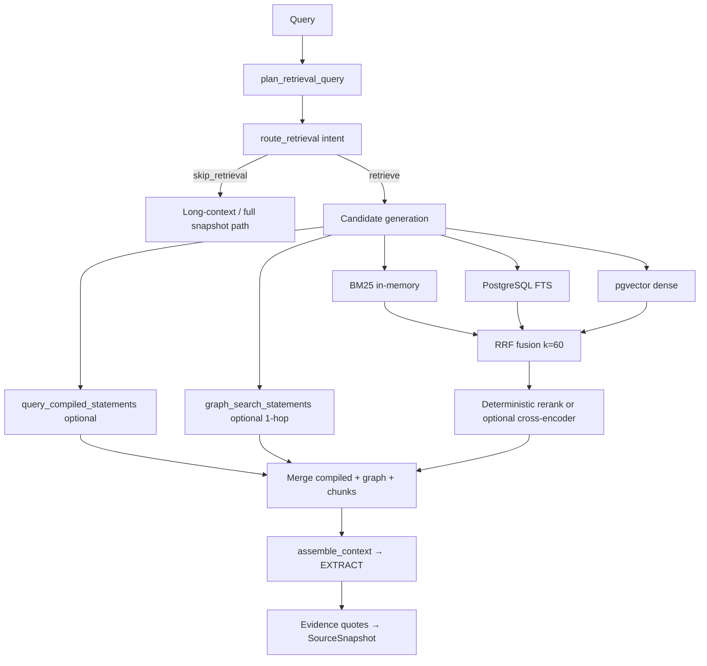

# RAG Pipeline (Phase 5)

## Provenance chain

```text
Source → immutable SourceSnapshot → DocumentChunk (derived) → ChunkEmbedding (derived)
Evidence → quote resolved in SourceSnapshot.text (never embedding row)
```

## Indexing flow

1. Fetch creates `SourceSnapshot`
2. `index_snapshots_for_run` chunks text (`v2-contextual-1800-280`; `context_text` for embeddings)
3. Batch embeddings (Google `gemini-embedding-2` default **768** dims; OpenAI `text-embedding-3-small` may use 1536)
4. Persist vectors in `chunk_embeddings` with provider/model/dimensions/config_version
5. Snapshot `indexing_status` → `indexed` | `failed` | `skipped`

Chunking version: `v2-contextual-1800-280` (contextual prefix in `context_text` for embeddings only).

Backfill: `uv run python scripts/deepscout_index.py <run_id>`

## Retrieval flow



1. `plan_retrieval_query` → structured `QueryPlan` (entities, corpus, skip for small docs)
2. `route_retrieval` → intent-based retriever mix (`identifier`, `semantic`, `entity_relation`, …)
3. BM25 + Postgres FTS + pgvector dense (hybrid default) with contextual embeddings on `context_text`
4. Reciprocal Rank Fusion (k=60)
5. Deterministic rerank (source diversity, recency, exact-token boost); optional `RERANKER_MODE=cross_encoder`
6. Optional compiled wiki statements + local `knowledge_relations` graph (1-hop)
7. Extract uses retrieved passages as **search hints**; evidence quotes still resolved in full snapshot

Chunking: `v2-contextual-1800-280`. Embeddings: `v2-dim768-contextual-prefix` (768 default).

## Isolation

Every SQL query filters `research_run_id`. No cross-run retrieval.

## Configuration

See `.env.example`: `EMBEDDING_*`, `RETRIEVAL_MODE`, `RETRIEVAL_TOP_K`, `RETRIEVAL_CANDIDATE_K`.

See ADR-008 and `RAG_TECHNIQUE_LANDSCAPE.md` for technique decisions.
