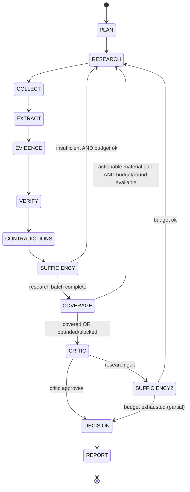

# Research Lifecycle

## States

## Termination (deterministic)

The **orchestrator** (`libs/research/orchestrator.py`, Phase 1+) enforces:

- `ResearchBudget` counters (iterations, wall time, tokens, cost, sources, tool calls)
- Phase gates (cannot skip VERIFY → DECISION)
- Evidence sufficiency evaluator (code + structured LLM output)

LangChain agent inner loops cannot extend the outer run beyond budget.

Task terminal states distinguish successful contribution from a bounded evidence gap:

- `COMPLETED`: the worker added an admissible source for its scoped objective.
- `BLOCKED`: bounded query reformulations produced no new admissible source, or a terminal
  dependency could not be satisfied.
- `FAILED`: a technical/tool execution failed.

Run outcomes are likewise explicit: complete, complete with limitations, budget exhausted,
evidence-blocked/no admissible sources, cancelled, or technical failure. SSE emits distinct terminal
events; the frontend localizes outcome messages instead of rendering backend reason strings.

## Iteration rule

New research iteration allowed only when:

1. `sufficiency == insufficient`
2. `budget.remaining > 0`
3. Critic or verifier produced actionable gaps (structured)

## Outputs per phase

| Phase | Persistent entities |
|---|---|
| PLAN | `ResearchPlan`, `ResearchQuestion` |
| COLLECT | `Source`, `SourceSnapshot` |
| EXTRACT | `Claim` |
| EVIDENCE | `Evidence` |
| CONTRADICTIONS | `Contradiction` |
| DECISION | `Decision` |
| REPORT | `Report` |

All phases emit LangSmith spans tagged `phase:<name>`.
