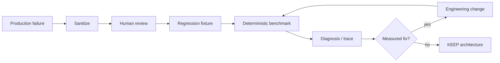

# Evaluations

DeepScout records evaluation results per terminal research run in PostgreSQL (`evaluation_results`, migration `012`).

## When evaluations run

1. **At finalization** — orchestrator calls `persist_research_evaluations` when a run reaches a terminal status.
2. **On read (legacy backfill)** — if a terminal run has no rows yet, the API computes deterministic evaluators once, persists, and returns them. Second read uses stored rows only (no recompute).
3. **Operator backfill** — `scripts/backfill_evaluation_results.py` for bounded batch backfill (no provider calls).

Demo browsing reads persisted results only — zero provider spend.

## Registry

`libs/evaluation/src/deepscout_evaluation/registry.py` defines **48 evaluator slots** per run (version `1` today). Each spec has:

| Field | Meaning |
|-------|---------|
| `category` | UI grouping (e.g. retrieval, security, planning, quality) |
| `method` | `automated_check`, `hybrid_evaluation`, `llm_as_judge`, … |
| `applicability` | When the evaluator can run |

### Applicability labels

| Label | Meaning |
|-------|---------|
| `active_now` | Can run online with current run artifacts |
| `offline_only` | Requires offline workflow / LangSmith experiment |
| `not_applicable_by_design` | Wrong modality (e.g. image evaluator on text research) |
| `ground_truth_required` | Needs labeled references |
| `advanced_evaluation` | Optional deeper eval pipeline |

## Result statuses (UI)

| Status | Meaning |
|--------|---------|
| `passed` | Deterministic check succeeded |
| `failed` | Deterministic check failed |
| `score` | Numeric metric (e.g. duplicate retrieval rate) |
| `skipped` | Applicable but missing runtime artifact or policy skip |
| `unavailable` | Cannot run online (offline-only, missing ground truth, etc.) |
| `not_applicable` | Evaluator does not apply to this run type |
| `error` | Execution error |
| `pending` | Run not terminal yet |

The UI hides most `not_applicable_by_design` rows. Generic “not evaluated” is not shown when a precise status exists.

## What runs online today

Deterministic evaluators in `run_evals.py` include:

- Claim/evidence coverage, citation resolve rate, provenance
- Budget compliance, duplicate work, DAG validity
- Security scans (SSRF URLs, secret/PII patterns, prompt injection heuristics)
- Trajectory / phase adherence checks
- Retrieval isolation and duplicate candidate rate

## What does **not** run online (honest unavailable)

Examples:

- RAGAS faithfulness / context precision (optional import; offline)
- Recall@K, Precision@K, MRR without labeled chunks
- LLM-as-judge answer relevance (offline workflow)
- LangSmith-hosted code evaluators when not configured

Do not expect all 48 rows to show PASS — many correctly show **Unavailable** with a reason string.

## Retrieval quality benchmark (offline / live)

Repeatable suite for router intents, ablation, contextual comparison, compiled knowledge, and local graph retrieval:

```bash
# Router only — no DB, no provider keys
uv run python scripts/retrieval_quality_benchmark.py --router-only

# Full live benchmark — local Postgres + embedding provider
uv run python scripts/retrieval_quality_benchmark.py --live
```

Dataset: `libs/evaluation/data/retrieval_quality_benchmark_v2.json` (deterministic ground truth, not live-web dependent).

### Benchmark v2 audit (August 2026)

| Dimension | v2 corpus | Production regression v1 |
|-----------|-----------|---------------------------|
| Origin | 100% synthetic fixture docs | Sanitized development/production-style patterns |
| Size | 5 docs, 12 router cases, 7 retrieval cases | 12 docs, 15 regression cases, 4 router boundaries |
| Identifier bias | High (CVE, product codes) | Moderate (CVE + semantic/engineering mix) |
| Multilingual | Minimal | IT + EN paired identifier/semantic cases |
| No-answer | 1 failure fixture | Explicit quantum + injection cases |
| Compiled / graph | Dedicated sub-fixtures | Flags on entity-relation / mixed cases |
| Contextual | 2-case comparison | 1 contextual disambiguation case |
| Authority vs relevance | Limited | `reg-en-authority-not-relevance` |
| Contradiction | Via mixed intent | `reg-en-conflicting-sources` |

v2 remains the **initial deterministic benchmark** — do not delete. Production regression v1 grows from real failures over time.

## Production retrieval regression (CI gate)

Versioned corpus for **real failure patterns** (sanitized before commit). Separate from v2 synthetic benchmark and from optional live evaluation.

| Artifact | Purpose |
|----------|---------|
| `libs/evaluation/data/retrieval_production_regressions_v1.json` | Regression cases + fixture documents |
| `libs/evaluation/data/retrieval_regression_baseline_v1.json` | Expected pass/fail policy per critical case |
| `libs/evaluation/src/deepscout_evaluation/retrieval_regression.py` | Gate, reporting, diagnostics |
| `libs/evaluation/src/deepscout_evaluation/retrieval_diagnostics.py` | Developer-only retrieval trace |
| `libs/evaluation/src/deepscout_evaluation/retrieval_sanitizer.py` | Privacy/secret stripping |

```bash
# Deterministic CI gate — Postgres required, zero provider spend
uv run python scripts/retrieval_regression_gate.py

# Validate fixture schema/privacy only
uv run python scripts/retrieval_regression_gate.py --validate-only

# Machine-readable output
uv run python scripts/retrieval_regression_gate.py --json
```

### Adding a regression from a failed run

Operator workflow (never auto-commits):

```bash
uv run python scripts/retrieval_regression_ingest.py \
  --run-id <uuid> \
  --query "..." \
  --failure-class routing_failure \
  --notes "sanitized summary"

# Preview only by default; explicit write requires confirmation
uv run python scripts/retrieval_regression_ingest.py \
  --run-id <uuid> --query "..." --write --confirm
```

Requirements:

1. Sanitize tenant/user/secrets/private URLs before commit
2. Human review of `relevant_doc_ids` / phrases
3. Tool refuses export when secrets cannot be stripped
4. No automatic learning — fixtures enter Git only after review

### Failure taxonomy

Uses `RetrievalFailureClass` in `libs/core/src/deepscout_core/domain/contracts.py` (extended for routing, fusion, rerank, graph, compiled, provenance, no-answer classes). `infer_retrieval_failure_class()` in `retrieval_diagnostics.py` provides stage hints from trace + metrics.

### Three evaluation modes (do not mix results)

| Mode | Command | Cost |
|------|---------|------|
| **Deterministic CI** | `scripts/retrieval_regression_gate.py` | BM25 + router on fixtures |
| **Synthetic benchmark v2** | `scripts/retrieval_quality_benchmark.py --router-only` / `--live` | Router free; live uses embeddings |
| **Production regression corpus** | Same gate script | Grows with sanitized failures |

### Evaluation loop



Legacy scripts still useful for focused checks:

- `scripts/retrieval_ablation_offline.py` — BM25 phrase-recall on v1.1 corpus
- `scripts/phase5_closure_gate.py` — dimension + hybrid ablation + pre-RAG vs RAG
- `scripts/compiled_knowledge_benchmark.py` — RAW vs COMPILED modes

## Persistence schema

Unique constraint: `(research_run_id, evaluator_id)`. Version changes create new semantics via `evaluator_version` column.

## API

Workspace payload includes `evaluations` array when run is terminal. Export endpoints follow the same persisted rows where implemented.

## For contributors

- Add evaluators in `registry.py` + computation in `run_evals.py` or dedicated module
- Map to matrix rows in `matrix.py`
- Tests: `tests/evaluation/`
- See [AGENTS.md](../AGENTS.md)
