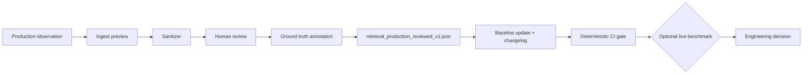
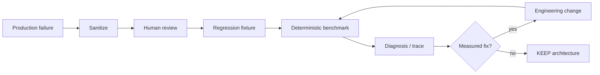
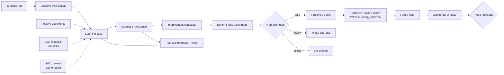

# Evaluations

DeepScout records evaluation results per terminal research run in PostgreSQL (`evaluation_results`, migration `012`).

## When evaluations run

1. **At finalization** — orchestrator calls `persist_research_evaluations` when a run reaches a terminal status.
2. **On owner read (legacy backfill)** — if a terminal private run has no rows yet, the API
   computes deterministic evaluators once, persists, and returns them. Public-demo reads never
   backfill or mutate evaluation state.
3. **Operator backfill** — `scripts/backfill_evaluation_results.py` for bounded batch backfill (no provider calls).

Demo browsing reads persisted results only — zero provider spend.

## Registry

`libs/evaluation/src/deepscout_evaluation/registry.py` defines **70 evaluator slots** per run (version `1` today). Each spec has:

| Field | Meaning |
|-------|---------|
| `category` | UI grouping (e.g. retrieval, security, planning, quality) |
| `method` | `automated_check`, `hybrid_evaluation`, `llm_as_judge`, … |
| `applicability` | When the evaluator can run |

### Applicability labels

| Label | Meaning |
|-------|---------|
| `active_now` | Can run online with current run artifacts |
| `offline_only` | Requires offline workflow / LangSmith experiment |
| `not_applicable_by_design` | Wrong modality (e.g. image evaluator on text research) |
| `ground_truth_required` | Needs labeled references |
| `advanced_evaluation` | Optional deeper eval pipeline |

## Result statuses (UI)

| Status | Meaning |
|--------|---------|
| `passed` | Deterministic check succeeded |
| `failed` | Deterministic check failed |
| `score` | Numeric metric (e.g. duplicate retrieval rate) |
| `skipped` | Applicable but missing runtime artifact or policy skip |
| `unavailable` | Cannot run online (offline-only, missing ground truth, etc.) |
| `not_applicable` | Evaluator does not apply to this run type |
| `error` | Execution error |
| `pending` | Run not terminal yet |

The UI hides most `not_applicable_by_design` rows. Generic “not evaluated” is not shown when a precise status exists.

## What runs online today

Deterministic evaluators in `run_evals.py` include:

- Claim/evidence coverage, citation resolve rate, provenance
- Goal-conditioned source portfolio adequacy, source-kind diversity/compliance, publisher-family
  independence, freshness for time-sensitive objectives, primary-source ratio, fetch success,
  original-citation rate, publisher duplication, cross-source corroboration, and contradiction
  resolution rate
- Budget compliance, duplicate work, DAG validity
- Security scans (SSRF URLs, secret/PII patterns, prompt injection heuristics)
- Trajectory / phase adherence checks
- Retrieval isolation and duplicate candidate rate
- Material requirement coverage and requirement-aware source-portfolio adequacy
- Quantitative coverage and comparison completeness when applicable
- ReportContract/final-critic compliance
- Goal-conditioned multilingual query coverage, original source-language metadata, translation
  provenance/leakage, requested output-language compliance, and multilingual contradiction handling

`task_completion` is semantic: a `completed` status alone is insufficient. It also requires material
coverage and a passing contract-aware final critic. `termination_correctness` applies the same rule to
`completed`; failed runs also require a matching `run.failed` event. Trajectory, plan adherence, and
tool-selection checks fail when a historical worker emitted `worker.completed` with zero sources, and
source-portfolio adequacy cannot pass with an empty source set. Budget-exhausted/cancelled/failed
terminal states retain their explicit semantics.

## What does **not** run online (honest unavailable)

Examples:

- RAGAS faithfulness / context precision (optional import; offline)
- Recall@K, Precision@K, MRR without labeled chunks
- LLM-as-judge answer relevance (offline workflow)
- LangSmith-hosted code evaluators when not configured

Do not expect all 53 rows to show PASS — many correctly show **Unavailable** with a reason string.

## Retrieval quality benchmark (offline / live)

Repeatable suite for router intents, ablation, contextual comparison, compiled knowledge, and local graph retrieval:

```bash
# Router only — no DB, no provider keys
uv run python scripts/retrieval_quality_benchmark.py --router-only

# Full live benchmark — local Postgres + embedding provider
uv run python scripts/retrieval_quality_benchmark.py --live
```

Dataset: `libs/evaluation/data/retrieval_quality_benchmark_v2.json` (deterministic ground truth, not live-web dependent).

The cross-language benchmark is separate and auditable:

```bash
# Language routing only — no DB or provider calls
uv run python scripts/multilingual_retrieval_benchmark.py

# PostgreSQL + configured embedding provider; reports every ablation independently
uv run python scripts/multilingual_retrieval_benchmark.py --live --summary
```

Dataset: `libs/evaluation/data/multilingual_retrieval_benchmark_v1.json`. It covers IT→EN,
IT→DE, EN→IT, FR→EN, DE→EN, localized aliases, stable identifiers, and a no-answer negative.
The live command reports BM25-only, FTS-only, dense-only, two-way hybrids, three-way RRF, and the
production full-RRF/rerank path. It is a manual provider-spend benchmark, not a CI gate.

### Benchmark v2 audit (August 2026)

| Dimension | v2 corpus | Synthetic regression v1 |
|-----------|-----------|-------------------------|
| Origin | 100% synthetic fixture docs | `development_synthetic` only |
| Size | 5 docs, 12 router cases, 7 retrieval cases | 12 docs, 15 cases, 4 router boundaries |
| CI role | Optional live benchmark | Router + BM25 lexical gate |

v2 remains the **initial deterministic benchmark** — do not delete.

## Retrieval regression corpora (CI gate)

Corpus semantics are explicit — see `libs/evaluation/data/retrieval_corpus_manifest_v1.json`.

| Corpus | File | CI | Provider spend |
|--------|------|----|----------------|
| Synthetic regression | `retrieval_synthetic_regressions_v1.json` | Yes | None |
| Pipeline deterministic | `retrieval_pipeline_deterministic_v1.json` | Yes | None (frozen vectors) |
| Production reviewed | `retrieval_production_reviewed_v1.json` | Yes (when non-empty) | None |
| Quality benchmark v2 | `retrieval_quality_benchmark_v2.json` | No | Optional live |
| Production candidates | `retrieval_production_candidates.local.json` | **No** | N/A (gitignored) |

### Origin taxonomy

| Origin | Meaning | In CI baseline? |
|--------|---------|-----------------|
| `development_synthetic` | Engineered fixture | Yes |
| `benchmark_fixture` | v2 benchmark sub-fixture | Optional |
| `production_candidate` | Exported from run, pending review | **Never** |
| `production_reviewed` | Sanitized + human-reviewed | Yes |
| `historical_regression` | Preserved legacy regression | Yes |

### Deterministic CI gate (full pipeline)

```bash
uv run python scripts/retrieval_regression_gate.py
uv run python scripts/retrieval_regression_gate.py --validate-only
uv run python scripts/retrieval_regression_gate.py --json
```

The gate runs **without provider API calls**:

1. **Synthetic corpus** — router + BM25 lexical retrieval
2. **Pipeline fixture** — RRF, rerank, frozen-vector hybrid retrieval, FTS, compiled, graph, contextual contract
3. **Production-reviewed corpus** — empty until first promoted case

Frozen dense vectors test **application logic** (fusion → rerank → selection), not embedding provider quality. Live semantic quality remains in `scripts/retrieval_quality_benchmark.py --live`.

Baseline policy: `retrieval_regression_baseline_v2.json` (case-level critical gates, not aggregate score thresholds).

| Artifact | Purpose |
|----------|---------|
| `retrieval_synthetic_regressions_v1.json` | Synthetic pattern regressions |
| `retrieval_pipeline_deterministic_v1.json` | RRF/rerank/frozen-dense/compiled/graph gates |
| `retrieval_production_reviewed_v1.json` | Reviewed production-derived cases (currently empty) |
| `retrieval_regression_baseline_v2.json` | Critical case policy + changelog |
| `retrieval_regression.py` / `retrieval_pipeline_gate.py` | Gate runners |
| `retrieval_diagnostics.py` | Developer-only trace |
| `retrieval_sanitizer.py` / `regression_origins.py` | Privacy + origin validation |

### Promotion workflow (no auto-learning)



```bash
# Preview only (production DB via railway run when needed)
railway run uv run python scripts/retrieval_regression_ingest.py \
  --run-id <uuid> --query "..." --notes "sanitized summary"

# Write to local candidates file (gitignored) — NOT the CI corpus
uv run python scripts/retrieval_regression_ingest.py \
  --run-id <uuid> --query "..." --write --confirm
```

After review, manually promote to `retrieval_production_reviewed_v1.json` with `origin: production_reviewed`.

### Three evaluation modes (do not mix results)

| Mode | Command | Cost |
|------|---------|------|
| **Deterministic CI** | `scripts/retrieval_regression_gate.py` | Zero provider spend |
| **Live benchmark** | `scripts/retrieval_quality_benchmark.py --live` | Embeddings (manual/scheduled) |
| **Production-reviewed** | Part of CI gate when cases exist | Zero |

**Scheduled live benchmark:** Not enabled in CI by default. Use manual `workflow_dispatch` or local runs only — avoids daily provider spend. Requires secrets + test DB; does not mutate production.

### Failure taxonomy

Uses `RetrievalFailureClass` in contracts + `infer_retrieval_failure_class()` for stage hints
(routing vs lexical vs dense vs fusion vs rerank vs graph vs compiled vs provenance). Multilingual
failures are separately classified as query-language mismatch, cross-language relevance false
negative, translation-quality failure, source-language portfolio gap, alias/entity-resolution
failure, or unsupported language pair.

### Evaluation loop (unchanged intent)



## Continuous learning loop (ADR-018)

System-wide controlled self-improvement extends evaluation — **not** autonomous code mutation.



| Layer | Command / path | CI | Provider spend |
|-------|----------------|----|----------------|
| Deterministic learning loop | `scripts/learning_loop_gate.py` | Yes | None |
| Learning effectiveness analytics | `scripts/learning_effectiveness_gate.py` | Yes | None |
| Retrieval regression | `scripts/retrieval_regression_gate.py` | Yes | None |
| Research completeness manifest | `scripts/research_completeness_gate.py` | Yes | None |
| Live benchmark | `scripts/retrieval_quality_benchmark.py --live` | No | Manual |
| Experience store | migrations `014`–`016` (`learning_cases`, `improvement_candidates`, `learning_policy_versions`, monitoring, audit) | N/A | None |
| Operator UI | `/learning` (hosted, owner-scoped) | N/A | None |

### Trust levels

| Level | Meaning |
|-------|---------|
| `untrusted_observation` | Raw signal, not actionable |
| `sanitized_candidate` | Passed sanitizer, pending review |
| `reviewed_case` | Human-reviewed |
| `validated_learning` | Synthetic fixture or validated offline |
| `promoted_policy` | Active versioned policy |

### Defaults

- Public demos **never** create learning cases
- A new failed terminal observation persists a sanitized LearningCase, a draft candidate, and a
  durable deterministic experiment job. This is observation/experimentation, not promotion.
- `production_candidate` never auto-promotes to CI or global policy
- Promotion default: **NO CHANGE** when inconclusive
- Nine adaptive policy families are runtime-wired; values clamped by `HARD_BOUNDS`
- Learning ≠ promotion: improvement requires post-promotion measurement (monitoring, cohort comparison, rollback)
- User feedback is an untrusted signal; HITL review events are authoritative — neither overrides security invariants

See [ADR-018](architecture/adr/ADR-018-continuous-learning.md) and
[CONTINUOUS_LEARNING.md](architecture/CONTINUOUS_LEARNING.md).

Legacy scripts still useful for focused checks:

- `scripts/retrieval_ablation_offline.py` — BM25 phrase-recall on v1.1 corpus
- `scripts/phase5_closure_gate.py` — dimension + hybrid ablation + pre-RAG vs RAG
- `scripts/compiled_knowledge_benchmark.py` — RAW vs COMPILED modes

## Persistence schema

Unique constraint: `(research_run_id, evaluator_id)`. Version changes create new semantics via `evaluator_version` column.

## API

Workspace payload includes `evaluations` array when run is terminal. Export endpoints follow the same persisted rows where implemented.

## For contributors

- Add evaluators in `registry.py` + computation in `run_evals.py` or dedicated module
- Map to matrix rows in `matrix.py`
- Tests: `tests/evaluation/`
- See [AGENTS.md](../AGENTS.md)
